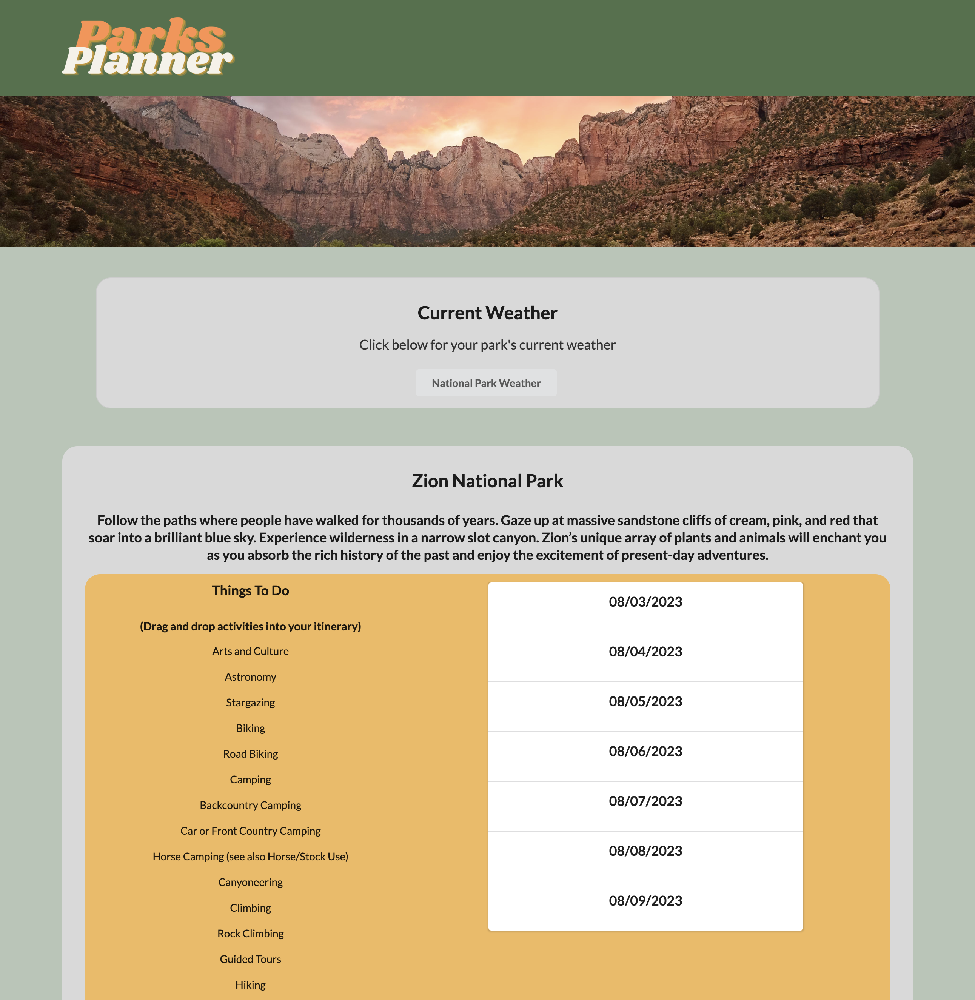

# Parks Planner

## User Story
AS A camper

I WANT to see the camping sites in/around a national park I’m visiting

SO THAT I can plan where to stay and what to do while I’m there

## Acceptance Criteria
GIVEN a camping dashboard with form inputs

WHEN I search for a national park

THEN I am shown a list of campsites in or around that national park, along with a weather forecast for that park.

WHEN I click on a given campsite

THEN I am able to see the campsite's amenities and general information including reservation and fee info. 

WHEN I confirm and save my chosen campsite

THEN I am presented with a page that includes current weather for the national park I chose, along with a list of activities that can be added to my travel itinerary.

## Usage
Begin by typing your chosen national park into the search bar at the top of Get Started.
Select the start and end dates of your trip.
Choose whether or not you will need help finding a campsite, then click 'confirm'.
If you need help finding a campsite, a list of local campsites will populate directly below the 'Get Started' container.
To see information about a specific campsite simply click the right arrow button on the right side of the list. 
You will then be shown that campsite's amenities and general information directly below the list of campsites.
Confirm that you want that specific campsite by clicking 'I have reserved this site, save to My Campsite'.

Now you will be taken to the results page. At the top you can see an image form your chosen national park, along with a button to show the park's current weather.
Below the weather section there you are presented with your chosen national park's name, a description of the park, and a list of local activities.
You can click and drag activities from this list into the itinerary planner on the right side of the page.
At the bottom of the page there as a tab that contains information about the campsite that you selected on the original search page.

## References/Acknowledgements
For the itinerary date range selector we found this example code that runs off of Semantic UI- https://jsbin.com/hubanufuva/1/edit?html,js,output
ChatGPT was also used to troubleshoot and correct certain issues with our website.

## Working URL
https://leucisticboi.github.io/ParksPlanner/

## Screenshot

